
# Pubnub

Pubnub is data stream network for developers to build realtime web applications.

Here at Stamplay we love Pubnub because we love the real-time web, and how simple Pubnub makes building real-time features in our applications.

Recently we added Pubnub as an integration for Stamplay, and we are very excited to show you how to get started with Stamplay + Pubnub.

### Shop With Me

To showcase how to use Pubnub we will be building a collaborative shopping list, **Shop With Me**, where users may check off items on a list, and the list we be updated for all who are currently viewing it.

### What You'll Need

Before we dive into code, you'll need :

* A Stamplay [account](https://stamplay.com) - <small>free</small>
* A Pubnub [account](https://pubnub.com) - <small>free</small>
* To clone this repo
	* run `git clone https://github.com/isaiahgrey93/shop-with-me`

Alright, looks like we are ready to begin!

###### Create A Pubnub Application

After you've signed in to your Pubnub account, create a new Pubnub application.

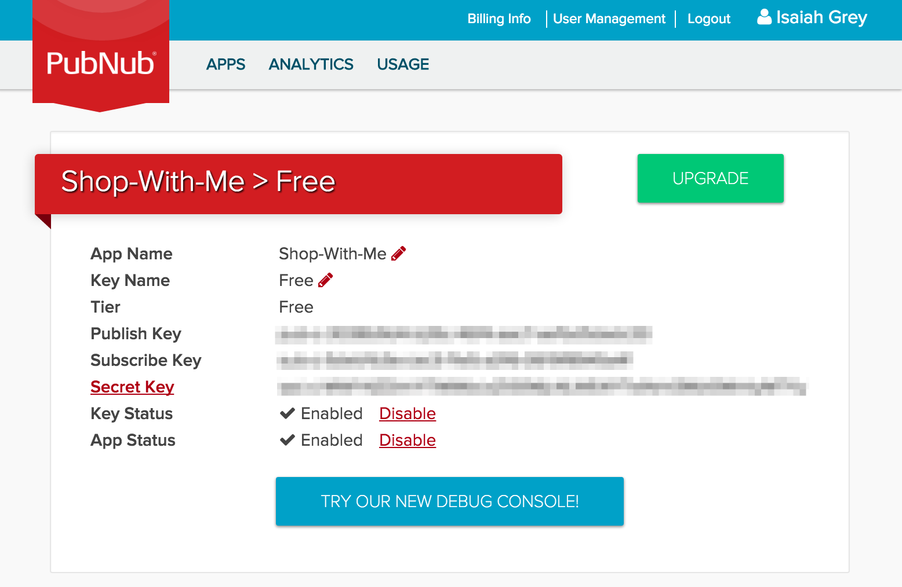

Keep the **Publish Key** and **Subscribe Key** on hand and head over to the [Stamplay Editor](https://editor.stamplay.com).

###### Create A Stamplay Application

After signing into your Stamplay account, create a new Stamplay app by entering a new app name into the field an submitting the form.

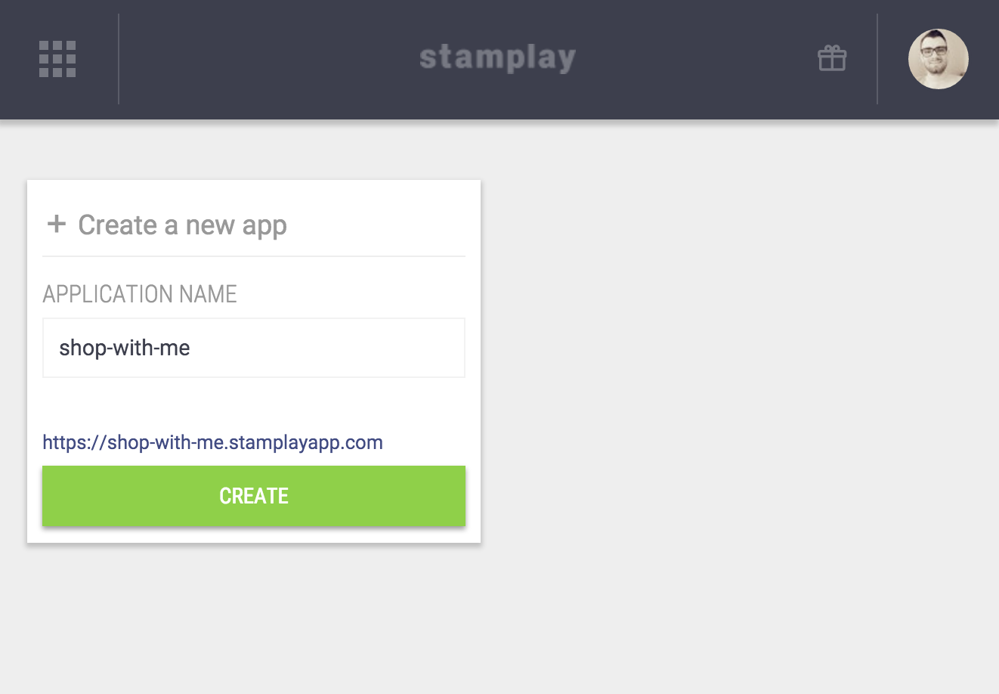

###### Add The Pubnub Integration

Now that you application is created, we need to connect Pubnub to our Stamplay application.

Click on **Tasks** on the left-hand menu, then **Components**.

Find and select the **Pubnub** integration.

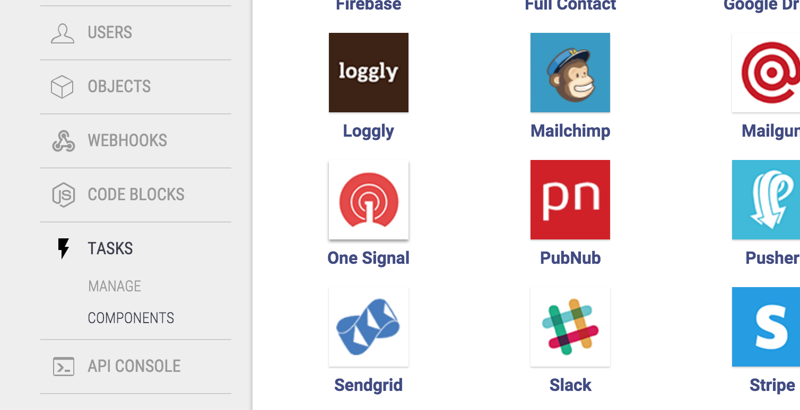

Inside the configuration, add the **Publish Key** and **Subscribe Key** to their respective fields, and connect.

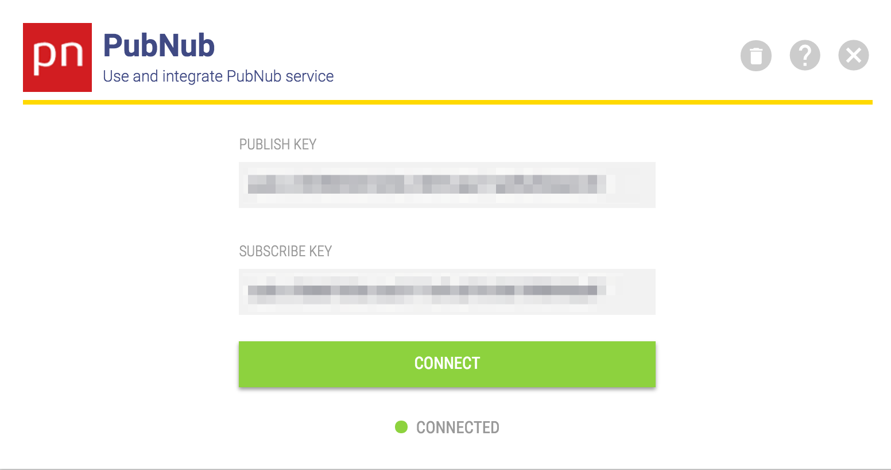

Next we will get to work on the client side.

###### Our Client Side Project

Inside the `shop-with-me` repository you cloned earlier, run the `stamplay init` command in Terminal and enter your `Application ID` and `Secret Key` as instructed in the prompt.

Change the `public` property to point to the `app` directory inside our `stamplay.json`. This will make the `app` directory the root of our Stamplay project.

Inside our `app/index.html` we have already included the Pubnub SDK, Stamplay SDK, and the Angular Service wrapper for each. We'veYou can find each library and it's documentation in the link's below:

- Stamplay JavaScript SDK [https://github.com/pubnub/javascript](https://github.com/pubnub/javascript)
- Stamplay Angular Service - [https://github.com/Stamplay/angular-stamplay](https://github.com/Stamplay/angular-stamplay)
- Pubnub JavaScript SDK - [https://github.com/pubnub/pubnub-angular](https://github.com/pubnub/pubnub-angular)
- Pubnub Angular Service - [https://github.com/pubnub/pubnub-angular](https://github.com/pubnub/pubnub-angular)
- Notification Service - [https://github.com/matowens/ng-notify](https://github.com/matowens/ng-notify)

The intialization of our application is almost complete. 

We just need to add our Stamplay Application ID <small>(hint : the name of your application)</small>, to the `Stamplay.init()` method, and the **publish**/**subscribe** keys to the `Pubnub.init()` method.

You can do this by adding the corresponding credentials to their placeholders inside `app/js/modules/app.module.js` file inside the `app.run` setup of our application.

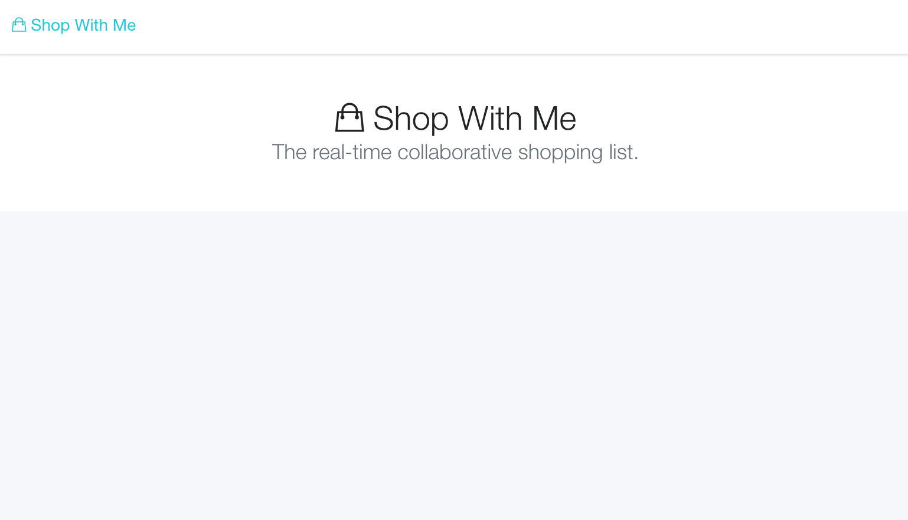

###### Adding User Accounts

To add user accounts all we need to do is make a request to some of the CORE APIs each Stamplay application comes with by default.

First we will need to create an angular service that will interact with our application backend regarding user accounts. Create a new file in our `app/services` folder, as `user.service.js`.

In our new angular service, we will intialize a new angular factory, and inject `$q` to provide a promise wrapper and ensure the order our application code executes.

Add two method to the return object of our service, `login` and `signup`.

Our login, and signup method are simple. Pass an object to the service method with an email and password properties, and pass back the response, or error to the controller.

Now that we have a service to manage accounts, add a state, `account` in `app/js/modules/app.module.js` below the `home` state :
 
Go ahead an add `AccountController` as the state controller attribute even though we have yet to create it.

Inside our `app/views/account.html` we have a tab setup, that show's a login or signup form depending on the tab you click. The click simply sets variable and shows the tab looking for that value, and hides the other.

Add link in the header inside our `app/index.html` to the account state, with a state paramter as a property depending on the button clicked.

Next we will add the `AccountController` we just set for the `account` state. Add `account.controller.js` to the `app/js/controllers` directory.

Here we will define methods to: 

- get the current user logged in - `userStatus`
- login to an account - `$scope.login`
- create a new account - `$scope.signup`
- end a user session - `$scope.logout`

Our `AccountController` method user the `User` Service to interact with the application backend to manage the user accounts and session. To read more about interacting with Stamplay regarding users, you can find more information in the documentation [here](https://stamplay.com/docs/jssdk/v2). 

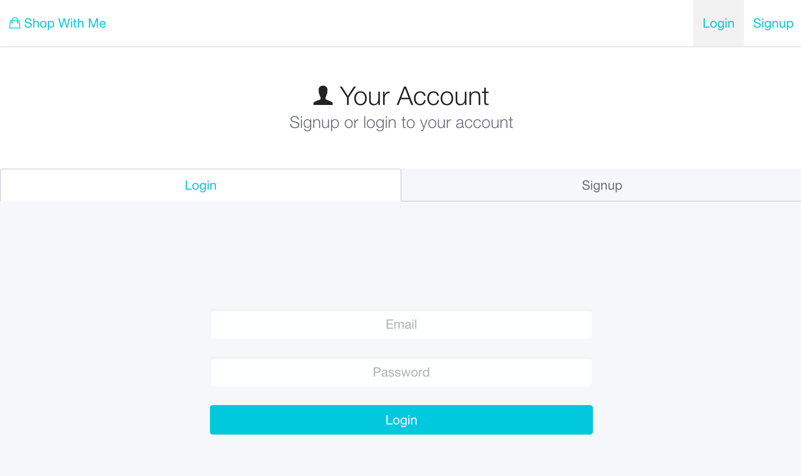

Now that we have user accounts and session setup, we can start creating shopping list's that we can invite our friends by email to work on.

###### Adding Data Models for our Shopping Lists

Inside our Stamplay [editor](https://editor.stamplay.com) we need to add a new schema for shopping lists.

First we will add an `item` schema. Name the schema `item` inside the **Object Name** field.

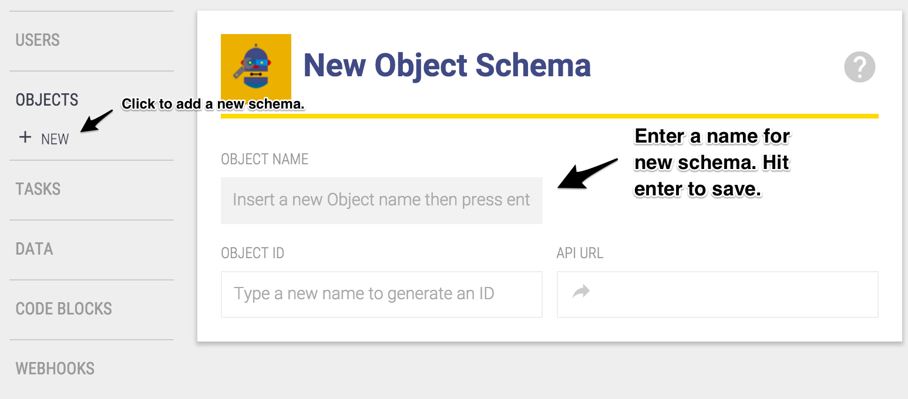

Add the following properties to the schema :

* name - *string*
* complete - *boolean*
* list - *string*

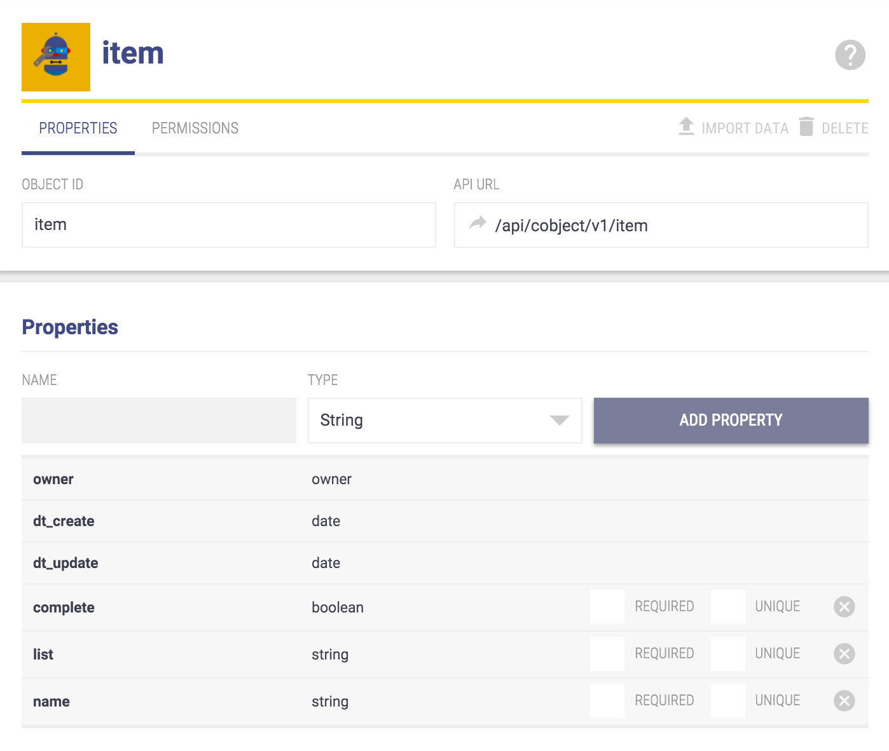

Now add another schema, named `list` with the following properties :

* name - *string* (The descriptive name of our shopping list)
* slug - *string* - ***unqiue*** (The descriptive identifier based of the name)

Now our data schemas are setup, we can start using these resources on the client side.

Whenever we create a schema within Stamplay, API endpoints are generated for each. The base endpoint is `/api/cobject/v1/[schema-name]`.

This is incredibly useful as it saves a lot of time setting up these resources ourselves with validation and everything on the server side.

###### Creating New Shopping Lists in our Client Side App

Back inside our project, we can now add functionality to create new shopping lists.

First we will create a service to add a new list.

Inside the `app/js/services` folder add a new file `list.service.js`.

Our `List` service will have two methods to start. One method will be `createList` which will do just that, and save a new list to our database. The other will be `checkName`, which will query Stamplay for a list name that matches the input for the new list; if none list name or slug matches then we will enable the user to submit the name to create a new list.

Note: The `slug` property serves as a identifier based of the list name. This is done by taking the list name, making sure each charcter is lowercased, and all spaces are replaced with a `-` character.

The slug is what we will query Stamplay for when checking for a list that already exists by the name, because this will eliminate two lists existing that are the same spelling, but with different casing. After implementing creating, we will use this slug to be able to access each list within the url at `/lists/[slug]`.

Inside our new `List` service, add a method for creating lists, and checking the name availability.

Next create a controller, `HomeController` for our `Home` state that will use our `List` service to valid list names, and create new lists.

Here in our controller we have a few `$scope` variables that will affect how the view is rendered.

Our `$scope.searching` variable will toggle the loading state on our input form. This will simply show/hide depending on the value a loading indicator inside the input.

Next our `$scope.invalidName` will enable/disable the form depending on the value (true/false). We will always disable the form while checking if the name exists in Stamplay, and if the input is empty. Only when the input is filled with a name that has been checked, and is not in use will the form be available for submission.

Finally, the `$scope.availability` is an object that contains the indicator of whether the name is available, unavailable, or a check for is in progress.

In between all of the state indicator updates, and form validators we have our two methods that our accessing the `List` service to check name availability, and create a new list.

Once a name is validated, and a list is created we will trigger a new state, `List` and pass in a parameter to that state, the `slug` based on the name of the list itself. We can access the slug property of the response inside our `$scope.createList` method, inside the promise of our call to our service, as `res`.

Next we will our `List` state where our users will be able to add items, and collaborate in real-time with other users on that list.

<small>(Our home state now)</small>

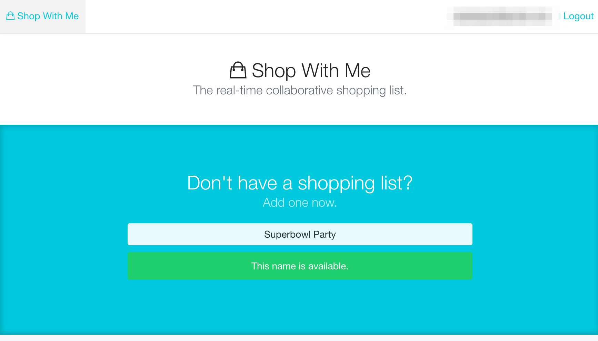

###### Adding Items To Our Shopping Lists

Next we will use a new state, `List` to add items to a list, and mark them off as you shop. You also will be able to update these items, as well as remove them if needed. To start, in our `app/modules/app.modules.js` add the `List` state below our `Acount` state, with a parameter for our task `slug` as follows:

Next we will add a method to our `List` service that will fetch our list in our newly created state. Inside our `app/js/services/list.service.js` add `getList` method. Here when we call on this method we will pass in the slug from our state url and retrieve the list with the same slug.

Now we can setup our view and controller to use our new service. Create a new view named `list.html` as prescribed in our  state configuration.

Then create a `ListController` inside your `app/js/controllers`. Don't forget to add the script references to your `index.html` at the bottom.

Our `ListController` will be fairly empty to start.

Now that our basic setup for this state is complete, we can start to fetch the data we need from Stamplay.

Inside our state configuration, we need to add a resolve to the state. This will enable us to grab data before the state controller is intialized. Allowing us to get to work right away.

In the future we will also add a resolve for our item data, in addition to the list data we will add now. Inside the `app.module.js`, update your state to include the resolve object, and `list` property that returns the `List` service method `getList`. We will pass in the slug from the url to the service.

Now inside our controller our the property `list` will be available as a dependency. It is injected into our controller at the top. After we inject this, we can start to use the value returned right away. Let's set the `$scope` variable `list` to the value of the injected dependency `list` from our state resolve.

Note: We inject the `List` services, and the `list` resolve from our state config.

Now the values we were trying to render in our template will display.

Next up is to add items to our list, and mark them off as we shop. First we will create a new service that will contain the methods for interacting with our Stamplay `item` object. Much like we did with the `List` service in our resolve to fetch our `list` data, we will also resolve our initial item data.

Create a new service inside the `app/js/services` as `item.service.js`. This will have three initial methods, `add`, `complete` and `getListItems`.

Our `getListItems` will fetch all `item` objects that have the `slug` of the list we are currently on. This slug is attached to our `item` whenever created. Right now we don't have any items quite yet but that is okay. First let's add another item to resolve in our state config.

Now inside our controller we can inject our new resolve item, `items`, and the `Item` service.

Right now we don't have any item, so let's remedy that by using our `Item` service to add items.

First setup the view with an input form that on submit triggers a `$scope` function that will call our service.

And in our `ListController` handle the form submission function attached to `$scope`.

Now we can iterate through our list of items as we create them to render them.

Inside our view again, add a block below our input using the `ng-repeat` directive to iterate through the `items` array in `$scope`.

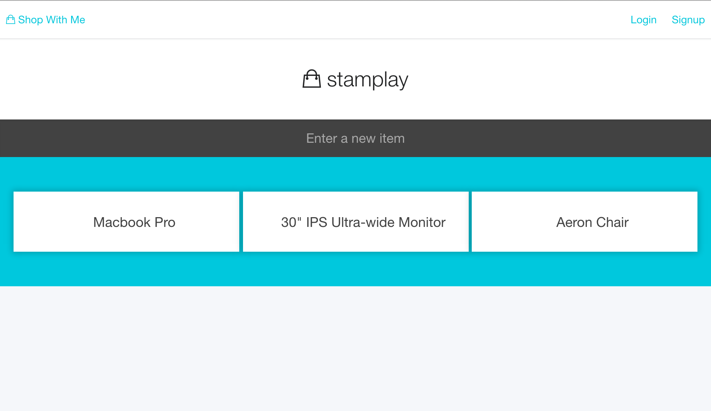

Now we can see the items in our list displayed. Next we can add a click event that will mark/complete the item and add a visual indication that it has been completed.

Setup our the `$scope.complete` funciton as described below, then attached this to an `ng-click` to each item as we iterate over them.

Inside our view, we can update our block where we repeat through `items` to mark an item complete whenever clicked.

No we can click our items to check them off, and then uncheck by reclicking the same items.

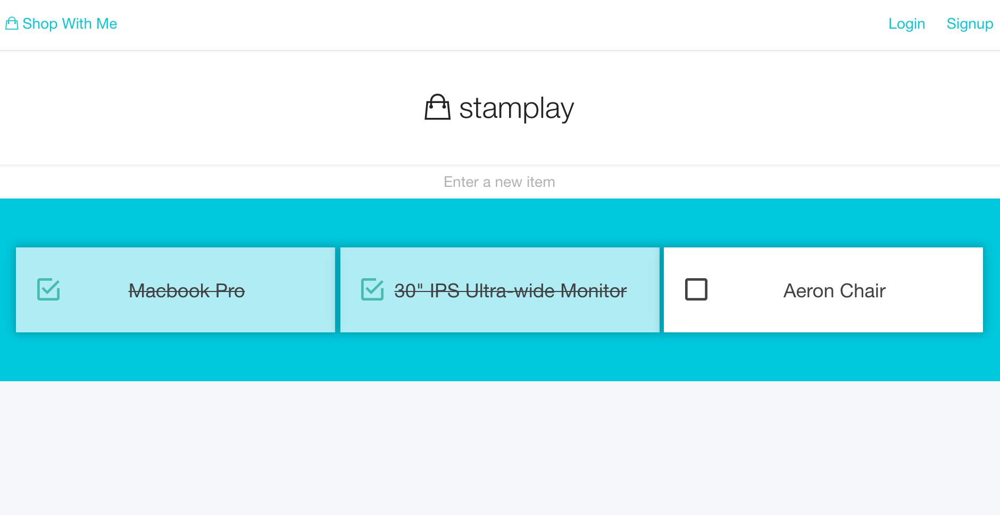

Next is to add the real-time features with Pubnub!

###### Making It A Real-Time Collaboration

To make our application real-time we will use `Pubnub` to publish data to a channel for each shopping list.

Inside our Stamplay editor, we can setup tasks to publish data when it is created, or updated to the channel it was created on. This will provide real-time updates for new data, and updates to data already within that application state for that shopping list.

First create a new Task:

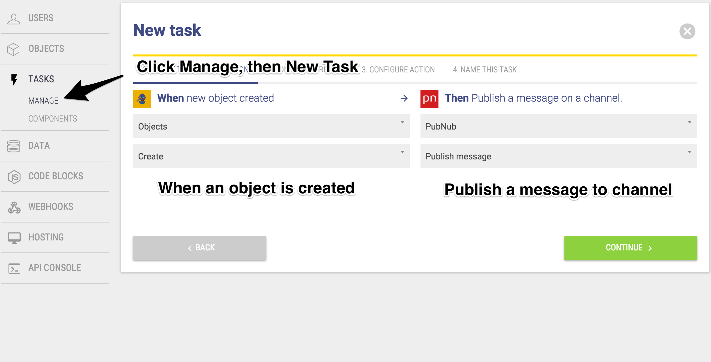

Then we can set what object type created, triggers our Task.

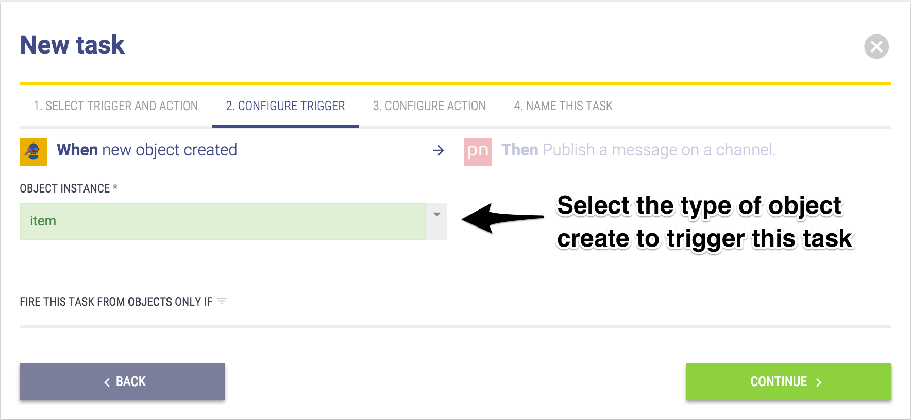

Now we configure which channel to publish our data to.
<small>You can copy the JSON for the data field below.</small>

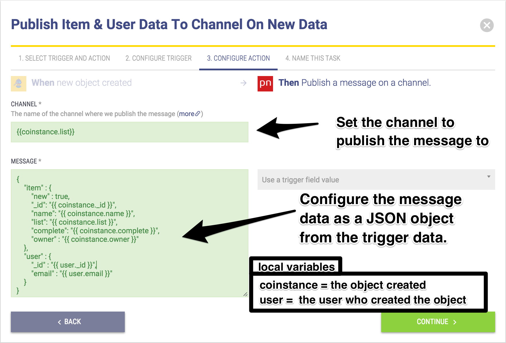

<pre>
<code>
{
	"item" : {
		"new" : true,
		"_id": "{{ coinstance._id }}",
		"name": "{{ coinstance.name }}",
		"list": "{{ coinstance.list }}",
		"complete": "{{ coinstance.complete }}",
		"owner" : "{{ coinstance.owner }}"
	},
	"user" : {
		"_id" : "{{ user._id }}",
		"email" : "{{ user.email }}"
	}
}
	</code>
</pre>

And in the last step, we just choose a name for our Task.

Next, we need to add another Task, but this time when an object is updated.

So back in the Task section add a new Task and configure as follows.

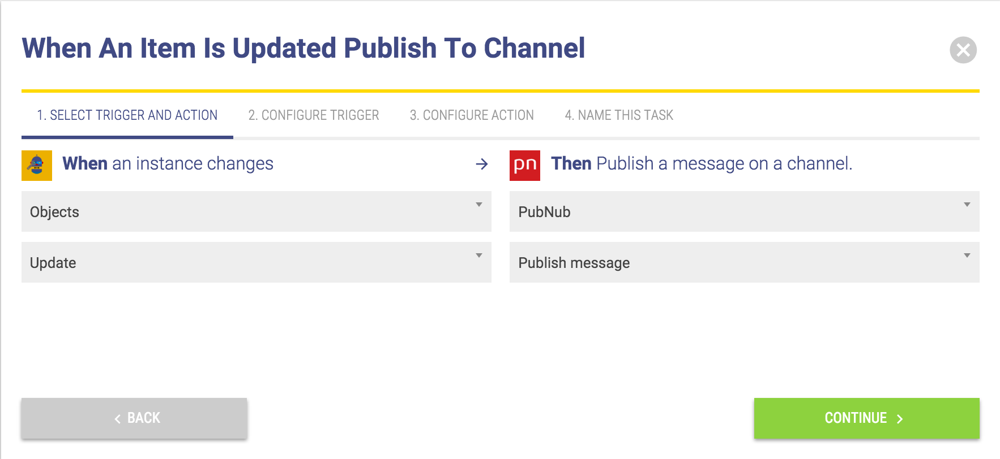

The configure the Task to trigger when an `item` object is updated in step two.

Next specify the channel from our trigger object, and pass in the data to send in the message to be published to the channel.
<small>The JSON data can be copied from below the image into the data field.</small>

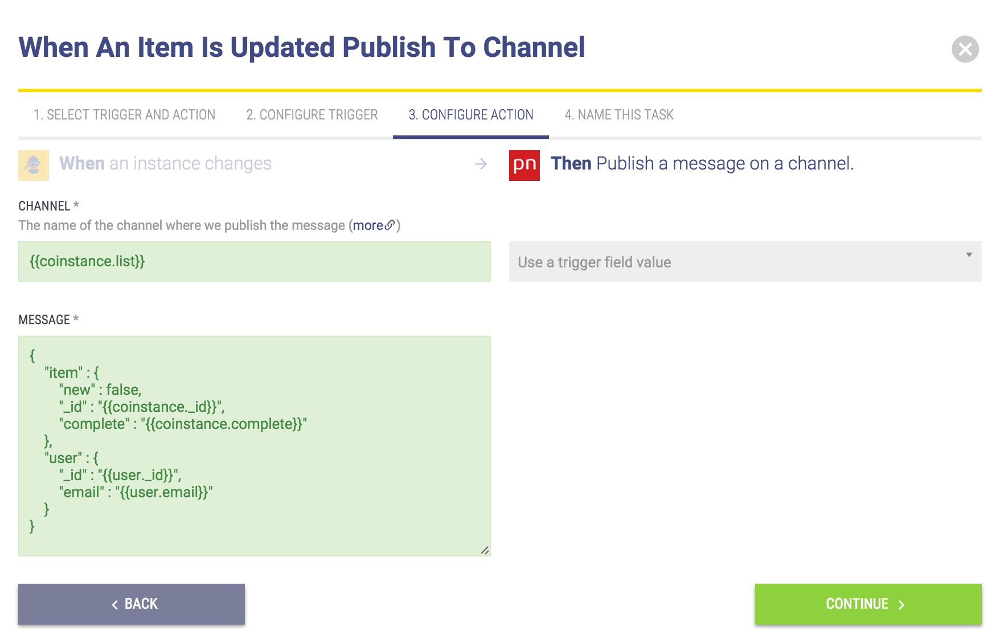

<pre>
	<code>
{
	"item" : {
		"new" : false,
		"_id" : "{{coinstance._id}}",
		"complete" : "{{coinstance.complete}}"
	},
	"user" : {
		"_id" : "{{user._id}}",
		"email" : "{{user.email}}"
	}
}
	</code>
</pre>

Then finally give your Task a name.

On the client side, we need to inject the `Pubnub` service into our `ListController`; also we can inject the `ngNotify` service we already have included from our base application setup.

The two properties on our `Pubnub` options paramter in the above config, are `channel` and `message`.

`channel` is the channel we wish to receieve event data when published to said channel.

`message` is the callback, and how we can handle the event data whenever data is published to the channel we subscribed to.

The channel that our data is published to will be the slug identifier for the shopping list. This is a unique identitifier we made, so we can be sure we are send, and receiving data that belongs to this list.

The message callback is how we will use the incoming event data. For our application we will check inside the callback if the data incoming is new, if it is we will simply push the object into the `$scope` items array and notify all the users apart from the one who made it (no point in notifying yourself).

If the item is not new, we know that simply the status of our item has changed, the property `complete` in particular. When this happens we need to iterate through the existing data in our items and find the one with the same `_id` as the incoming data.

After we update the property `complete` to whichever it was changed to, `true` or `false`.

This will be visually shown by the check mark icon, and the words being crossed out when complete is true, and uncrossed and unchecked when it is false(default value).

Right about now you may have an error, as we are using a `loggedin` variable but we haven't even created this quite yet. To test 

You can comment where these `if` statements are out to test without notification first, then continue to enable notifications.

Inside our `app/modules/app.module.js` file we have our state `List` and `Home`. Real quickly, we can add a resolve to each of these that access the `current` method of our `User` service. This will return to us whether or not a user is logged in or not, and if so will give us their information.

Then inside our controllers we can use the `loggedin` dependency to access this value. Inside our `message` callback of our Pubnub service `subscribe` we will use this to trigger the notications to all users apart from the user who either updated, or created the data itself.

After this we can use this same variable to validate incoming users to our list, and redirect them to login if they are currently not.

We can add this up at the top of our `ListController`:

Now back inside our `app.module.js` add search parameter to the state for `Account`. Change the `url` property from `/account/:tab` to `/account/:tab?list`.

Now inside our `AccountController` we can change our `userStatus` method to take users who have been redirected when trying to access the list back to the list after they authenticate their account.

Then one last update to lockdown our app, and make sure only authenticate users can create lists, and collaborate on them.

Inside our `HomeController` we need to add a statement that checks if a user is logged in when they go to create a list.

At the very top of our `$scope.createList` function, add an `if` statement to catch and return if a user is not logged in, and prompt them to login to continue.

And now our app is locked down to only let authenticated users interact with certain data, and states.

We haven't enabled invites to other users for our shopping lists. Lets add this now.

###### Inviting Others To Collaborate With Me

To invite other users to collaborate with me, we can setup a webhook that we can post our outgoing invite information.

To create a Webhook inside your Stamplay editor, click on the Webhook section on the left hand side, enter the name as `invite`, and click `create`.

Now that our Webhook is created, let's react to whenever data is posted to it.

Go over to Tasks and create a new Task.

Set it up as follows:

Now configure which webhook to trigger this Task as `invite`.

Next add in outgoing information in the fields based on the `incoming.body` object.

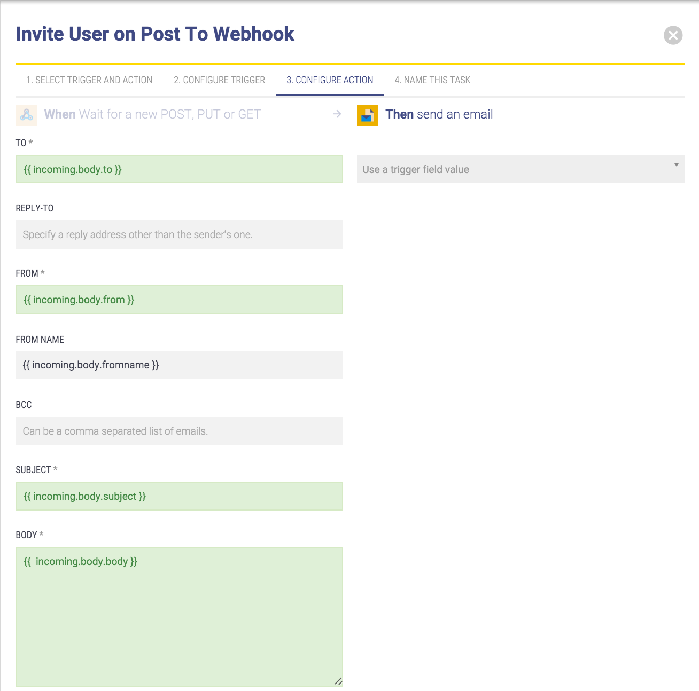

Add a name, then back on the client side  add a new method to our `List` service, as `inviteUser`.

Next add a form to our template for our `List` state, that is trigger on submit.

Then inside controller implement the `invite` $scope method called on submit to use our new `List` service method :

Now we can invite user!

